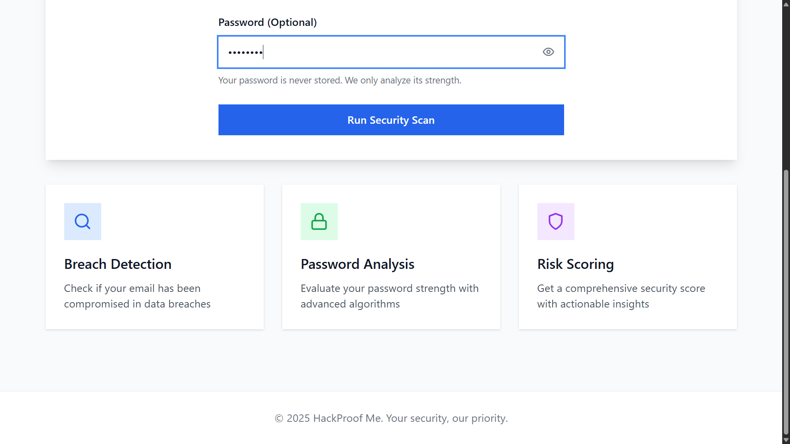
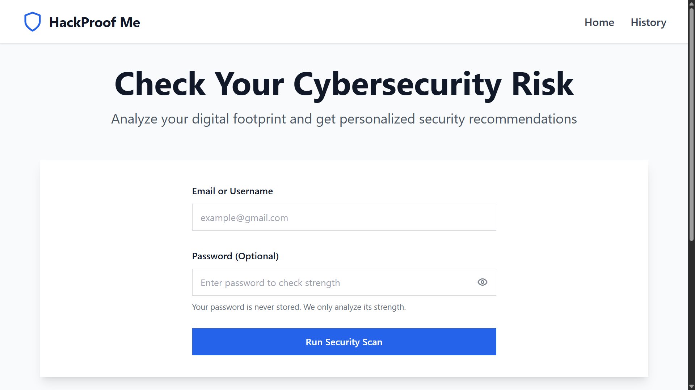
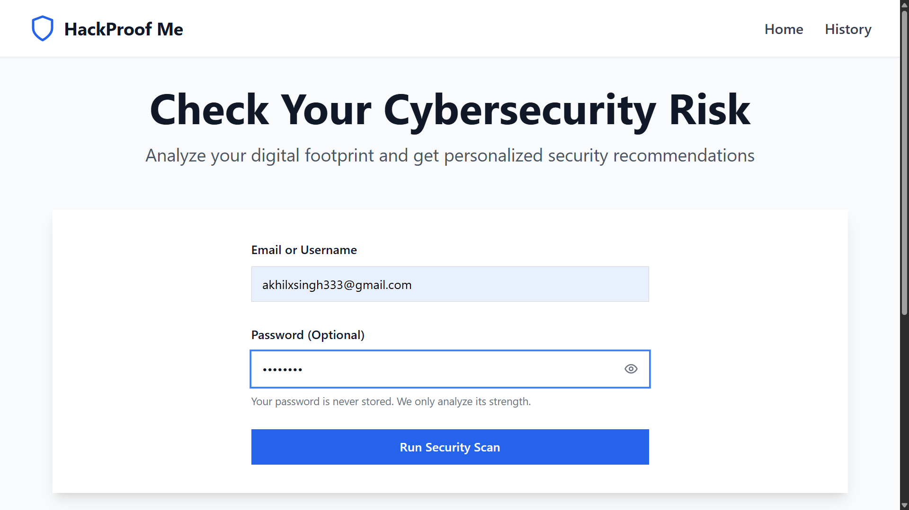
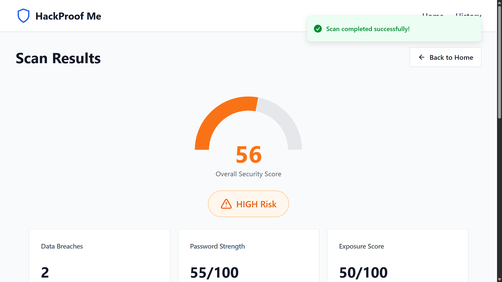
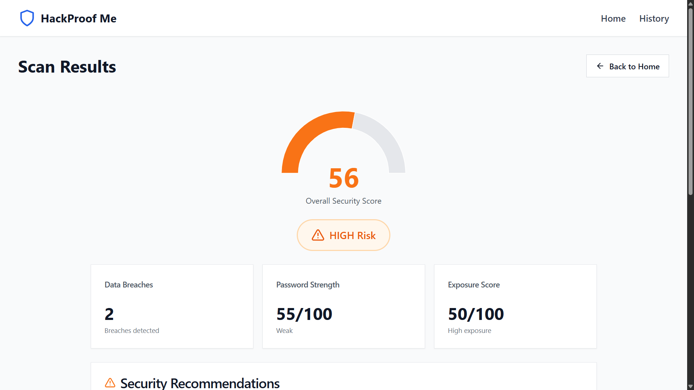
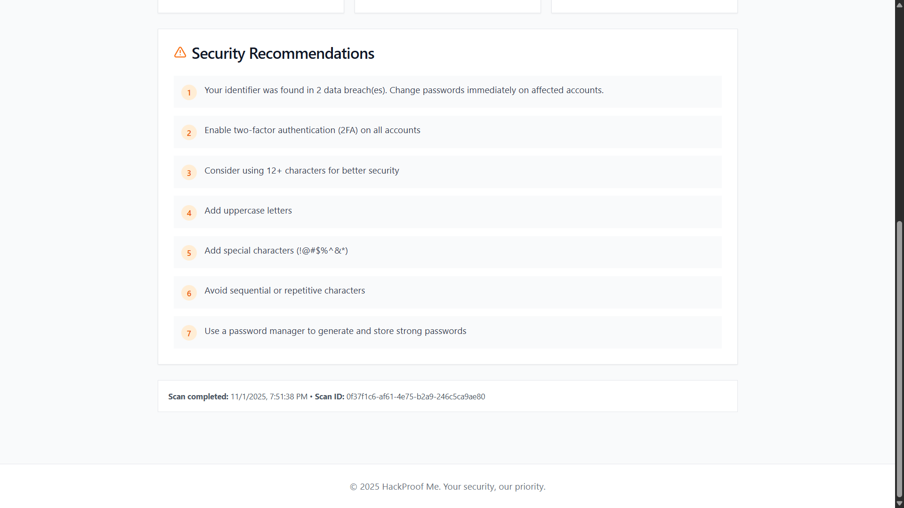
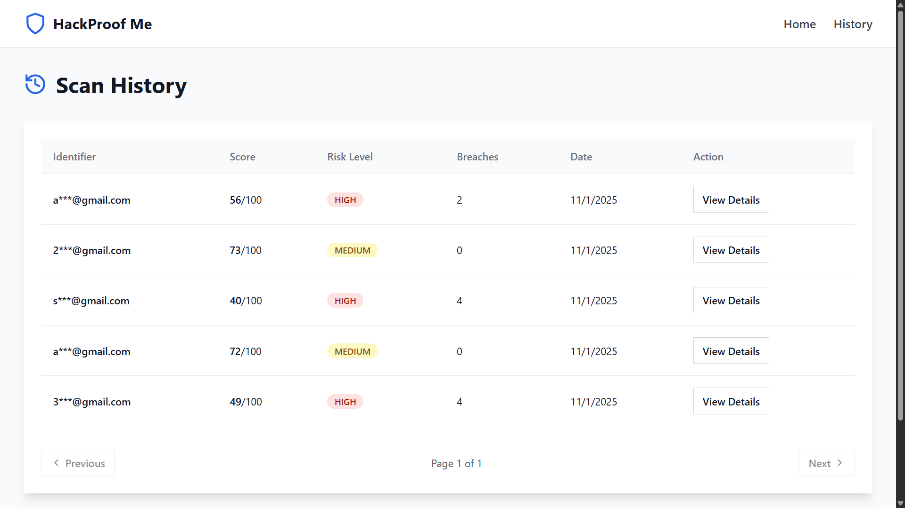

Got it 👍 Here's a **simple, clean README** version of your **HackProof Me** project — without installation or setup steps:

---

# 🛡️ HackProof Me - Cybersecurity Risk Analyzer

A full-stack web application that analyzes users' digital security posture by checking for data breaches, evaluating password strength, and calculating exposure risk.

---

## 🌟 Features

- **Data Breach Detection** – Checks if your email appears in known breaches
- **Password Strength Analysis** – Evaluates passwords using advanced algorithms
- **Exposure Risk Assessment** – Calculates your digital exposure level
- **Security Recommendations** – Gives personalized security tips
- **Scan History** – Tracks your security improvements over time
- **Visual Dashboard** – Displays interactive charts and risk metrics

---

## 🛠️ Tech Stack

### Backend

- Spring Boot 3.2.0
- MySQL 8.0
- JPA / Hibernate
- SpringDoc OpenAPI
- Maven

### Frontend

- React 18
- Vite
- TailwindCSS
- Recharts
- Axios
- React Router

---

## ⚙️ Configuration

Basic configuration is handled in Spring Boot properties files.
Update your database username and password in:

`backend/scan-service/src/main/resources/application.properties`

```properties
spring.datasource.username=root
spring.datasource.password=root
```

---

## 📊 Modules Overview

| Module                 | Description                                        |
| ---------------------- | -------------------------------------------------- |
| **OSINT Service**      | Handles external data breach checks                |
| **Scan Service**       | Core service that performs scans and risk analysis |
| **Frontend Dashboard** | User interface with results and recommendations    |

---

## 📈 Example Workflow

1. User enters email and password for analysis
2. System checks for known breaches
3. Password is evaluated for strength and entropy
4. Overall risk score is generated
5. Dashboard shows results and suggestions for better security

---

## 📸 Screenshots

### 1. Home Page - Hero Section


_Professional homepage with security features overview and clear call-to-action_

### 2. Home Page - Scan Form


_Complete home page showing the security scan form with email and password inputs_

### 3. Scan Form Input


_User enters credentials and clicks "Run Security Scan" button_

### 4. Scan Results Dashboard


_Beautiful results dashboard showing overall security score and risk level with detailed metrics_

### 5. Security Score Gauge


_Interactive gauge visualization showing security score (0-100) with color-coded risk indicator_

### 6. Security Recommendations


_Personalized security recommendations with actionable tips to improve security_

### 7. Scan History


_Complete scan history showing all previous security scans with scores and risk levels_

---

## 🔐 Security Features

- SHA-256 identifier hashing
- No password storage (analysis only)
- CORS protection
- Input validation
- SQL injection prevention

---

## 👨‍💻 Author

**Akhil Singh**

---

## 🧾 Conclusion

HackProof Me helps users assess and strengthen their online security by combining breach detection and password analysis in one place.
It empowers everyone to stay one step ahead of cyber threats.

---

## 🧾 License

This project is licensed under the [MIT License](./LICENSE) © 2025 Akhil Singh.
